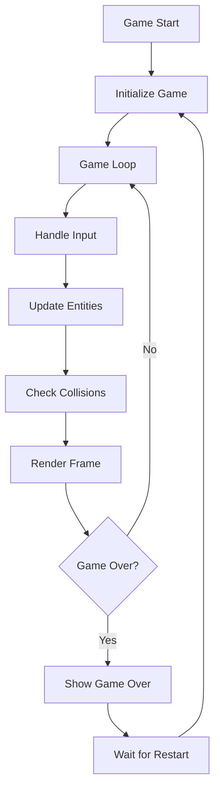

# Design Document

## Overview

DemoGame은 HTML5 Canvas API를 활용한 2D 종스크롤 슈팅게임입니다. 객체지향 설계 패턴을 사용하여 게임 엔티티들을 관리하고, 게임 루프를 통해 실시간 렌더링과 업데이트를 수행합니다. 모듈화된 구조로 설계하여 유지보수성과 확장성을 확보합니다.

## Architecture

### 전체 시스템 구조

```
DemoGame/
├── index.html          # 메인 HTML 파일
├── css/
│   └── game.css       # 게임 스타일링
├── js/
│   ├── game.js        # 메인 게임 엔진
│   ├── entities/
│   │   ├── player.js  # 플레이어 우주선
│   │   ├── enemy.js   # 적 엔티티
│   │   ├── bullet.js  # 총알 엔티티
│   │   └── particle.js # 파티클 효과
│   ├── managers/
│   │   ├── inputManager.js    # 입력 처리
│   │   ├── collisionManager.js # 충돌 감지
│   │   ├── soundManager.js     # 사운드 관리
│   │   └── uiManager.js        # UI 관리
│   └── utils/
│       ├── vector2d.js # 2D 벡터 유틸리티
│       └── utils.js    # 공통 유틸리티
└── assets/
    ├── images/        # 스프라이트 이미지
    └── sounds/        # 사운드 파일
```

### 게임 루프 아키텍처



## Components and Interfaces

### 1. Game Engine (game.js)

메인 게임 엔진으로 전체 게임 상태를 관리합니다.

```javascript
class Game {
    constructor(canvasId)
    init()
    start()
    gameLoop()
    update(deltaTime)
    render()
    reset()
}
```

**주요 책임:**
- 게임 루프 관리
- 엔티티 생성 및 제거
- 게임 상태 관리 (시작, 진행, 종료)
- 프레임 레이트 제어

### 2. Entity System

모든 게임 객체의 기본 클래스입니다.

```javascript
class Entity {
    constructor(x, y, width, height)
    update(deltaTime)
    render(ctx)
    destroy()
    getBounds()
}
```

#### Player (player.js)
```javascript
class Player extends Entity {
    constructor(x, y)
    handleInput(inputManager)
    shoot()
    takeDamage()
}
```

#### Enemy (enemy.js)
```javascript
class Enemy extends Entity {
    constructor(x, y, type)
    move(deltaTime)
    shoot() // 일부 적들은 총알 발사
}
```

#### Bullet (bullet.js)
```javascript
class Bullet extends Entity {
    constructor(x, y, direction, speed, owner)
    move(deltaTime)
    checkBounds()
}
```

### 3. Manager Classes

#### InputManager (inputManager.js)
```javascript
class InputManager {
    constructor()
    update()
    isKeyPressed(key)
    isKeyDown(key)
    handleTouchInput() // 모바일 지원
}
```

#### CollisionManager (collisionManager.js)
```javascript
class CollisionManager {
    checkCollisions(entities)
    checkAABB(entity1, entity2)
    handleCollision(entity1, entity2)
}
```

#### UIManager (uiManager.js)
```javascript
class UIManager {
    constructor(canvas)
    drawScore(score)
    drawGameOver(finalScore)
    drawStartScreen()
    handleResize()
}
```

## Data Models

### 게임 상태 모델

```javascript
const GameState = {
    MENU: 'menu',
    PLAYING: 'playing',
    PAUSED: 'paused',
    GAME_OVER: 'game_over'
};

const gameData = {
    score: 0,
    lives: 3,
    level: 1,
    state: GameState.MENU,
    entities: {
        player: null,
        enemies: [],
        bullets: [],
        particles: []
    }
};
```

### 엔티티 설정 모델

```javascript
const EntityConfig = {
    PLAYER: {
        speed: 300,
        width: 32,
        height: 32,
        fireRate: 0.2
    },
    ENEMY: {
        BASIC: {
            speed: 100,
            width: 24,
            height: 24,
            points: 10
        },
        FAST: {
            speed: 200,
            width: 20,
            height: 20,
            points: 20
        }
    },
    BULLET: {
        PLAYER: {
            speed: 500,
            width: 4,
            height: 8
        },
        ENEMY: {
            speed: 200,
            width: 4,
            height: 8
        }
    }
};
```

## Error Handling

### 1. 리소스 로딩 에러
- 이미지 로딩 실패 시 기본 색상 도형으로 대체
- 사운드 로딩 실패 시 무음으로 진행
- 로딩 상태 표시 및 에러 메시지 제공

### 2. 게임 런타임 에러
- try-catch 블록으로 게임 루프 보호
- 엔티티 업데이트 실패 시 해당 엔티티만 제거
- 브라우저 호환성 문제 대응

### 3. 입력 처리 에러
- 키보드 이벤트 리스너 실패 시 기본 동작 유지
- 터치 이벤트 지원 여부 확인
- 입력 지연 및 중복 처리 방지

## Testing Strategy

### 1. 단위 테스트
- 각 엔티티 클래스의 메서드 테스트
- 충돌 감지 알고리즘 정확성 검증
- 유틸리티 함수 테스트

### 2. 통합 테스트
- 게임 루프 전체 흐름 테스트
- 엔티티 간 상호작용 테스트
- 입력-게임 로직-렌더링 파이프라인 테스트

### 3. 성능 테스트
- 60fps 유지 여부 확인
- 메모리 누수 검사
- 다양한 브라우저에서의 성능 측정

### 4. 사용자 경험 테스트
- 다양한 화면 크기에서의 반응형 동작
- 키보드 및 터치 입력 반응성
- 게임 밸런스 및 난이도 조정

## 렌더링 시스템

### Canvas 렌더링 파이프라인

1. **배경 렌더링**: 스크롤되는 우주 배경
2. **엔티티 렌더링**: 플레이어, 적, 총알 순서로 렌더링
3. **파티클 효과**: 폭발 및 특수 효과
4. **UI 오버레이**: 점수, 생명력, 게임 상태

### 스프라이트 시스템

- 스프라이트 시트를 사용한 효율적인 이미지 관리
- 애니메이션 프레임 관리
- 스프라이트 캐싱으로 성능 최적화

## 성능 최적화

### 1. 객체 풀링
- 총알과 파티클 객체 재사용
- 가비지 컬렉션 부하 감소

### 2. 렌더링 최적화
- 화면 밖 객체 컬링
- 더티 렉트 기법 적용 고려

### 3. 메모리 관리
- 불필요한 엔티티 즉시 제거
- 이벤트 리스너 정리